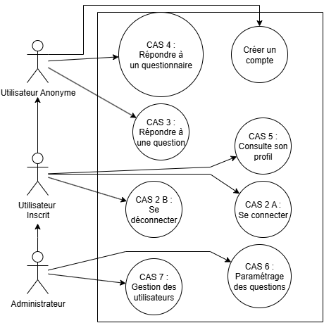
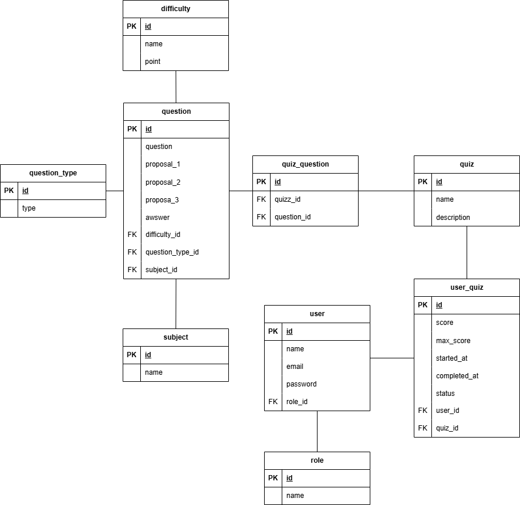

# Document d'architecture technique

## Table des matières

I. [Présentation du domaine métier choisi et justification de sa complexité](#i-pr%C3%A9sentation-du-domaine-m%C3%A9tier-choisi-et-justification-de-sa-complexit%C3%A9)  
II. [Analyse fonctionnelle avec cas d'usage principaux](#ii-analyse-fonctionnelle-avec-cas-dusage-principaux)  
III. [Architecture technique de l'écosystème de web services](#iii-architecture-technique-de-l%C3%A9cosyst%C3%A8me-de-web-services)  
IV. [Schéma de base de données avec relations complexes](#iv-sch%C3%A9ma-de-base-de-donn%C3%A9es-avec-relations-complexes)  
V. [Spécification des APIs avec liste des endpoints prévus](#v-sp%C3%A9cification-des-apis-avec-liste-des-endpoints-pr%C3%A9vus)  
VI. [Choix et justification de votre stack technologique](#vi-choix-et-justification-de-votre-stack-technologique)  
VII. [Architecture globale](#vii-architecture-globale)

## I. Présentation du domaine métier choisi et justification de sa complexité

Nous avons choisi de développer une application web de quiz interactive inspirée du célèbre jeu télévisé "Tout le monde veut prendre sa place". L'application propose aux utilisateurs de répondre à des questions selon trois modes de difficulté progressive :

- **"J'suis pas sûr"** : Mode assistance avec 2 propositions de réponse
- **"J'crois je l'ai"** : Mode intermédiaire avec 4 propositions de réponse  
- **"Let me cook"** : Mode expert sans proposition, réponse libre saisie par l'utilisateur

### Fonctionnalités principales

L'application offre deux modes de jeu :
- **Mode questionnaire** : Répondre à une série de questions organisées par thématique
- **Mode question aléatoire** : Répondre à une question tirée au sort selon des critères de filtrage (difficulté, sujet)

Les scores obtenus sont automatiquement sauvegardés pour les utilisateurs authentifiés et consultables dans leur historique personnel.

### Backoffice d'administration

Un espace d'administration complet permet la gestion de l'ensemble du contenu :
- Gestion CRUD des questions (création, modification, suppression)
- Gestion CRUD des dictionnaires et de leur composition
- Administration des utilisateurs et de leurs droits

<div style="page-break-after: always;"></div>

### Justification de la complexité

Ce domaine métier présente une complexité significative à plusieurs niveaux :

1. **Gestion des types de questions multiples** : Trois modes de réponse différents nécessitent une logique de validation et de présentation adaptée
2. **Système de scoring dynamique** : Calcul des scores en fonction de la difficulté et du mode choisi
3. **Filtrage et recherche avancés** : Combinaison de critères multiples (sujet, difficulté) pour sélectionner les questions
4. **Gestion des relations complexes** : Questions liées à plusieurs entités (sujet, difficulté, questionnaires)
5. **Authentification et autorisation** : Système utilisateur avec rôles différenciés (utilisateur standard, administrateur)
6. **Historique et statistiques** : Suivi des performances utilisateur, progression
7. **Administration avancée** : Interface backoffice complète avec contrôles d'accès stricts

## II. Analyse fonctionnelle avec cas d'usage principaux

### Acteurs du système

- **Utilisateur anonyme** : Peut répondre aux questions mais ne peut pas sauvegarder ses scores
- **Utilisateur authentifié** : Peut jouer aux quiz, sauvegarder ses scores et consulter son historique
- **Administrateur** : Gère l'ensemble du contenu (questions, questionnaires, utilisateurs)

### Cas d'usage principaux

#### CU1 : S'inscrire
**Acteur** : Utilisateur anonyme  
**Description** : L'utilisateur crée un compte avec pseudo, email et mot de passe  
**Préconditions** : Aucune  
**Postconditions** : Compte créé, utilisateur connecté automatiquement

#### CU2 : Se connecter / Se déconnecter
**Acteur** : Utilisateur inscrit  
**Description** : L'utilisateur s'authentifie avec email/mot de passe pour accéder à son espace personnel  
**Préconditions** : Compte existant  
**Postconditions** : Session active, accès aux fonctionnalités authentifiées

#### CU3 : Répondre à une question aléatoire
**Acteur** : Utilisateur (authentifié ou non)  
**Description** : L'utilisateur sélectionne un sujet et/ou une difficulté, puis choisit un mode de réponse ("J'suis pas sûr", "J'crois je l'ai", "Let me cook") et répond à une question tirée aléatoirement  
**Préconditions** : Des questions existent dans la sujet/difficulté choisie  
**Postconditions** : Réponse validée, score calculé et sauvegardé si utilisateur authentifié

#### CU4 : Répondre à un questionnaire complet
**Acteur** : Utilisateur (authentifié ou non)  
**Description** : L'utilisateur sélectionne un questionnaire et répond à l'ensemble des questions dans l'ordre  
**Préconditions** : Le questionnaire existe et contient des questions  
**Postconditions** : Score total calculé et sauvegardé si utilisateur authentifié

#### CU5 : Consulter son historique de scores
**Acteur** : Utilisateur authentifié  
**Description** : L'utilisateur consulte ses scores passés, ses statistiques et sa progression  
**Préconditions** : Utilisateur connecté  
**Postconditions** : Affichage de l'historique et des statistiques

#### CU6 : Gérer les tables dictionnaire (Admin)
**Acteur** : Administrateur  
**Description** : Créer, modifier, supprimer des questions avec leurs réponses, sujet et difficulté  
**Préconditions** : Authentifié en tant qu'administrateur  
**Postconditions** : Questions mises à jour dans la base de données

#### CU7 : Gérer les utilisateurs (Admin)
**Acteur** : Administrateur  
**Description** : Consulter la liste des utilisateurs, modifier leurs droits ou supprimer des comptes  
**Préconditions** : Authentifié en tant qu'administrateur  
**Postconditions** : Utilisateurs mis à jour



<div style="page-break-after: always;"></div>

## III. Architecture technique de l'écosystème de web services

### Vue d'ensemble

L'architecture repose sur un modèle **client-serveur découplé** avec communication via API REST.

```
┌──────────────────────────────────────────────────────────┐
│                    FRONTEND (Nuxt)                       │
│  ┌──────────────┐  ┌──────────────┐  ┌──────────────┐    │
│  │   Pages      │  │  Components  │  │  Composables │    │
│  │              │  │              │  │              │    │
│  │ - Quiz       │  │ - Question   │  │ - useQuiz()  │    │
│  │ - Home       │  │ - QuizCard   │  │ - useAuth()  │    │
│  │ - Profile    │  │ - Score      │  │ - useAPI()   │    │
│  │ - Admin      │  │ - AdminTable │  │              │    │
│  └──────────────┘  └──────────────┘  └──────────────┘    │
│                            │                             │
│                    API REST (HTTPS)                      │
└────────────────────────────┼─────────────────────────────┘
                             │
┌────────────────────────────▼─────────────────────────────┐
│                   BACKEND (Laravel API)                  │
│  ┌──────────────┐  ┌──────────────┐  ┌──────────────┐    │
│  │  Routes      │  │ Controllers  │  │   Models     │    │
│  │              │  │              │  │              │    │
│  │ - api.php    │  │ - UserCtrl   │  │ - User       │    │
│  │              │  │ - QuizCtrl   │  │ - Question   │    │
│  │              │  │ - AdminCtrl  │  │ - Score      │    │
│  └──────────────┘  └──────────────┘  └──────────────┘    │
│           │                                              │
│    ┌──────▼──────┐       ┌────────────┐                  │
│    │ Middleware  │       │  Services  │                  │
│    │ - Auth      │       │ - ScoreCalc│                  │
│    │ - Admin     │       │ - QuizGen  │                  │
│    └─────────────┘       └────────────┘                  │
│                            │                             │
└────────────────────────────┼─────────────────────────────┘
                             │
                    ┌────────▼────────┐
                    │   PostgreSQL    │
                    │   (Database)    │
                    └─────────────────┘
```

<div style="page-break-after: always;"></div>

### Composants principaux

#### Frontend (Nuxt)
- **Pages** : Vues principales de l'application (accueil, quiz, profil, admin)
- **Components** : Composants réutilisables (cartes de questions, affichage de scores, formulaires)
- **Composables** : Logique métier réutilisable (gestion auth, appels API, état global)
- **Middleware** : Protection des routes (authentification, rôles)

#### Backend (Laravel)
- **Routes API** : Définition des endpoints RESTful
- **Controllers** : Traitement des requêtes HTTP et orchestration de la logique métier
- **Models (Eloquent)** : Représentation des entités et relations de la base de données
- **Middleware** : Authentification (Sanctum), autorisation, validation
- **Services** : Logique métier complexe (calcul de scores, génération de quiz)


### Flux de communication

1. L'utilisateur interagit avec l'interface Nuxt
2. Les composables effectuent des requêtes HTTP vers l'API Laravel
3. Les middlewares Laravel vérifient l'authentification et les autorisations
4. Les controllers traitent la requête et utilisent les services/models
5. Les données sont récupérées/modifiées dans PostgreSQL via Eloquent
6. Le frontend reçoit les données et met à jour l'interface

<div style="page-break-after: always;"></div>

## IV. Schéma de base de données avec relations complexes



<div style="page-break-after: always;"></div>

## V. Spécification des APIs avec liste des endpoints prévus

### Authentification

| Méthode | Endpoint | Description | Auth |
|---------|----------|-------------|------|
| POST | `/api/register` | Créer un compte utilisateur | Non |
| POST | `/api/login` | Connexion (retourne token JWT) | Non |
| POST | `/api/logout` | Déconnexion | Oui |
| GET | `/api/user/me` | Informations du profil utilisateur | Oui |
| PUT | `/api/user/me` | Modifier son profil | Oui |
| DELETE | `/api/user/me` | Supprimer son compte | Oui |

### Questions

| Méthode | Endpoint | Description | Auth |
|---------|----------|-------------|------|
| GET | `/api/questions` | Liste des questions avec filtres (sujet, difficulté) | Non |
| GET | `/api/questions/random` | Obtenir une question aléatoire | Non |
| GET | `/api/questions/{id}` | Détail d'une question | Non |
| POST | `/api/questions` | Créer une question | Admin |
| PUT | `/api/questions/{id}` | Modifier une question | Admin |
| DELETE | `/api/questions/{id}` | Supprimer une question | Admin |
| POST | `/api/questions/{id}/verify` | Vérifier une réponse utilisateur | Non |

### Questionnaires

| Méthode | Endpoint | Description | Auth |
|---------|----------|-------------|------|
| GET | `/api/questionnaires` | Liste des questionnaires | Non |
| GET | `/api/questionnaires/{id}` | Détail d'un questionnaire avec questions | Non |
| POST | `/api/questionnaires` | Créer un questionnaire | Admin |
| PUT | `/api/questionnaires/{id}` | Modifier un questionnaire | Admin |
| DELETE | `/api/questionnaires/{id}` | Supprimer un questionnaire | Admin |
| POST | `/api/questionnaires/{id}/questions` | Ajouter des questions au questionnaire | Admin |

### Scores

| Méthode | Endpoint | Description | Auth |
|---------|----------|-------------|------|
| GET | `/api/scores` | Historique des scores de l'utilisateur | Oui |
| POST | `/api/scores` | Enregistrer un score | Oui |
| GET | `/api/scores/stats` | Statistiques personnelles | Oui |
| GET | `/api/leaderboard` | Classement général | Non |

### Sujets et métadonnées

| Méthode | Endpoint | Description | Auth |
|---------|----------|-------------|------|
| GET | `/api/sujets` | Liste des sujets | Non |
| GET | `/api/difficultes` | Liste des niveaux de difficulté | Non |


### Administration

| Méthode | Endpoint | Description | Auth |
|---------|----------|-------------|------|
| GET | `/api/admin/users` | Liste des utilisateurs | Admin |
| PUT | `/api/admin/users/{id}` | Modifier un utilisateur | Admin |
| DELETE | `/api/admin/users/{id}` | Supprimer un utilisateur | Admin |
| GET | `/api/admin/stats` | Statistiques globales de l'application | Admin |

## VI. Choix et justification de votre stack technologique

### Frontend : Nuxt avec TypeScript

Nous avons choisi **Nuxt** comme framework frontend pour plusieurs raisons :

- **Expérience avec l'équipe** : Technologie maitrisée et familière.
- **Performance optimale** : Nuxt offre le Server-Side Rendering (SSR) et la génération statique, ce qui améliore considérablement les temps de chargement et l'expérience utilisateur.
- **SEO amélioré** : Le rendu côté serveur permet aux moteurs de recherche d'indexer efficacement le contenu, un atout pour la visibilité de l'application.
- **Structure et conventions** : Nuxt impose une architecture claire (pages, components, composables) qui facilite la maintenance et la collaboration en équipe.
- **Écosystème Vue.js** : Basé sur Vue 3, Nuxt bénéficie d'une syntaxe intuitive, d'une réactivité performante et d'un vaste écosystème de plugins.
- **TypeScript natif** : L'intégration de TypeScript améliore la robustesse du code, la détection d'erreurs en développement et l'autocomplétion dans l'IDE.
- **Expérience développeur (DX)** : Hot Module Replacement, routing automatique, auto-imports et devtools intégrés accélèrent le développement.

### Backend : Laravel

Le choix de **Laravel** comme framework backend se justifie par :

- **Expérience avec l'équipe** : Technologie maitrisée et familière.
- **Écosystème mature et complet** : Laravel est l'un des frameworks PHP les plus populaires, avec une documentation exhaustive et une communauté active.
- **Eloquent ORM** : Permet de manipuler la base de données de manière élégante et intuitive, avec des relations complexes facilitées (One-to-Many, Many-to-Many, etc.).
- **API RESTful native** : Laravel facilite la création d'APIs avec des resource controllers, validation automatique, et transformation de données via les API Resources.
- **Sécurité intégrée** : Protection contre les injections SQL, CSRF, XSS, et gestion avancée de l'authentification via Laravel Sanctum pour les tokens API.
- **Migrations et Seeders** : Gestion versionnée de la base de données, facilitant le déploiement et la collaboration.
- **Middleware et Gates** : Gestion fine des autorisations et de la sécurité des routes (rôles admin, utilisateurs).
- **Tests unitaires et fonctionnels** : Laravel intègre PHPUnit et permet de tester facilement les APIs et la logique métier.
- **Artisan CLI** : Outil en ligne de commande puissant pour générer du code, gérer les migrations, lancer des tâches planifiées, etc.

### Base de données : PostgreSQL

**PostgreSQL** a été retenu pour ces raisons :

- **Expérience avec l'équipe** : Technologie maitrisée et familière.
- **Conformité ACID** : Garantit l'intégrité des transactions, essentiel pour la gestion des scores et des données utilisateurs.
- **Types de données avancés** : Support natif de JSON/JSONB, tableaux, types personnalisés, idéal pour stocker des données semi-structurées (réponses, configurations).
- **Performances sur requêtes complexes** : Optimisations avancées pour les jointures multiples, agrégations et requêtes avec sous-requêtes.
- **Extensibilité** : Possibilité d'ajouter des extensions (pg_trgm pour la recherche floue, uuid-ossp pour les UUID, etc.).
- **Contraintes d'intégrité strictes** : Foreign keys, unique constraints, check constraints garantissent la cohérence des données.
- **Open source et fiable** : Solution mature, stable et sans coûts de licence, avec un support communautaire important.

### VII. Architecture globale

L'architecture repose sur une **séparation frontend/backend** (architecture découplée) :
- **Frontend (Nuxt)** consomme l'API REST exposée par le backend
- **Backend (Laravel)** gère la logique métier, l'authentification, les autorisations et les accès aux données
- **Base de données (PostgreSQL)** stocke les données de manière structurée et sécurisée

Cette séparation permet :
- **Déploiement indépendant** : Frontend et backend peuvent être déployés sur des serveurs différents
- **Scalabilité** : Possibilité de scaler frontend et backend indépendamment selon les besoins
- **Maintenance facilitée** : Équipes frontend et backend peuvent travailler en parallèle
- **Réutilisabilité** : L'API Laravel peut être consommée par d'autres clients (application mobile, services tiers, etc.)

